#Challenge 1: Profiling#

**Step 1: Welcome!**
Open the Project in UNITY and play the game a few times by clicking on the PLAY button. You control the rocket by pressing A and D on the keyboard, and launch by pressing SPACE or click the Launch button on the user interface.
Above the rocket, there is a path indicator:
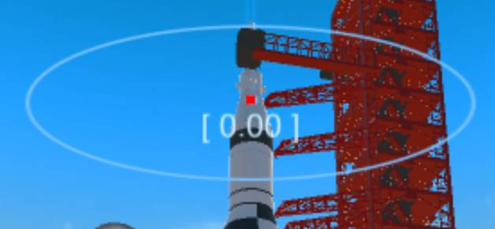

Your job is to keep the red dot as centered as possible (so the offset reading below the marker stays as close to 0.00 as possible). There is an in game line that also will show where the path goes:
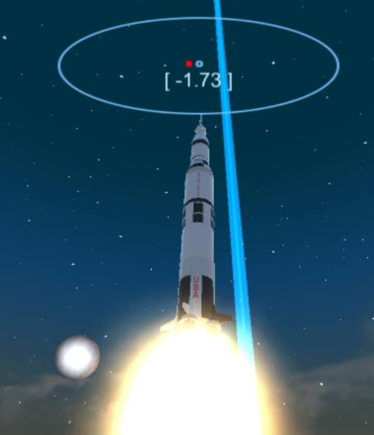

The launch conditions are windy, and the wind will try to push you off the path. Use A and D to slowly rotate the rocket back on track.
One round lasts for about 30 seconds, and you will be measured by how close you are to the path when you cross the finish line.
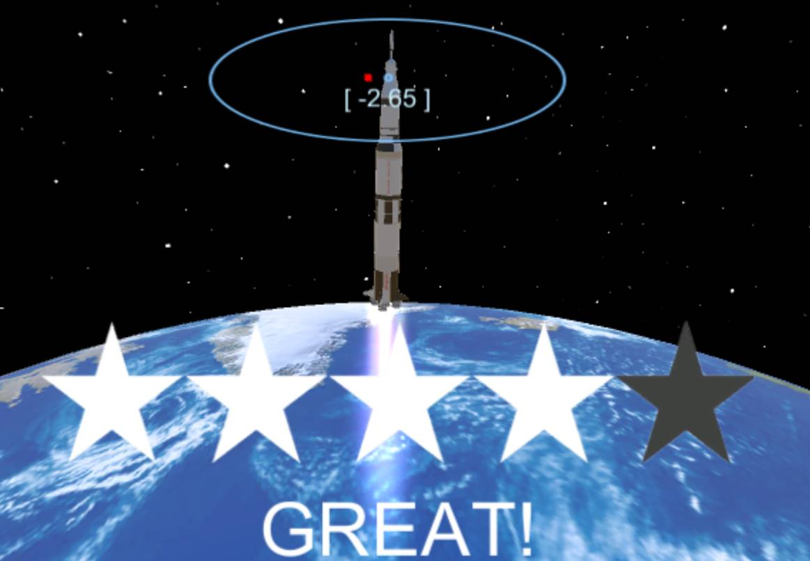


**Step 2: Exporting the game as a UWP**
Now that we know how the game works, we want to run it through a performance analysis to see if we are having any performance issues.

In Unity, click File->Build Settings
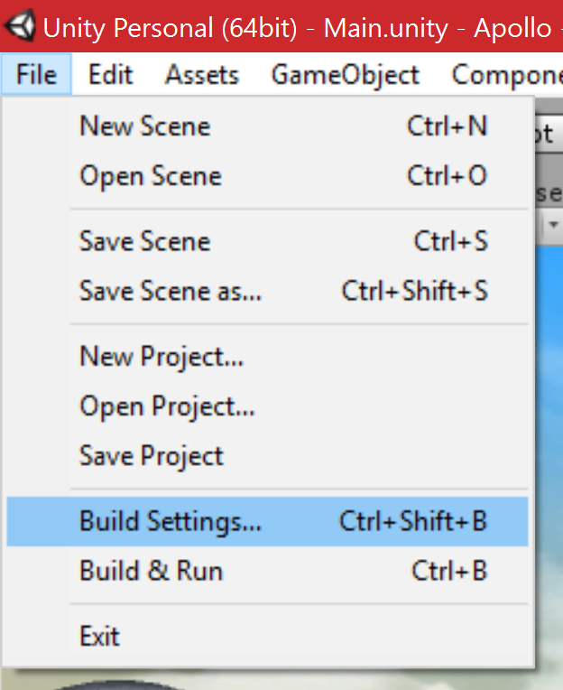

Select Windows Store, and from the dropdown, select Universal 10
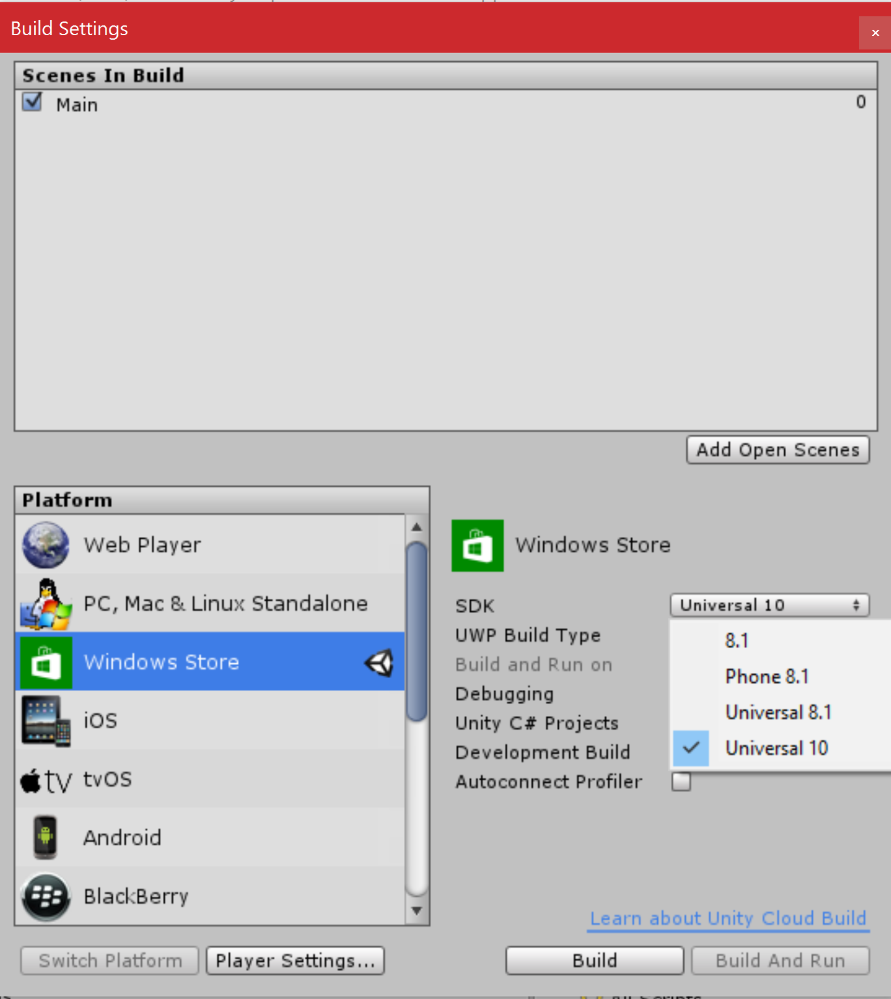

Make sure you also tick the Unity C# Projects and the Development Build check-boxes.
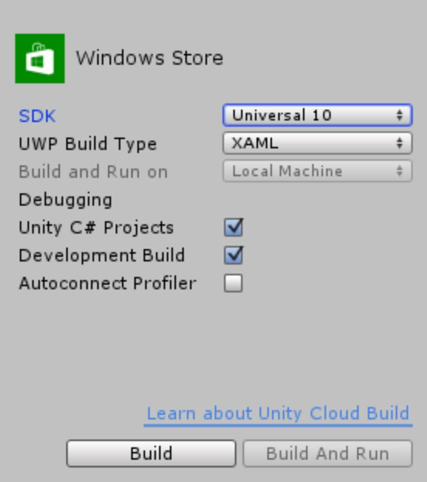

Next, click Build and create a subfolder in the rood project named EXPORT, and another one inside the new EXPORT folder called UWP and click Select Folder to start the export.

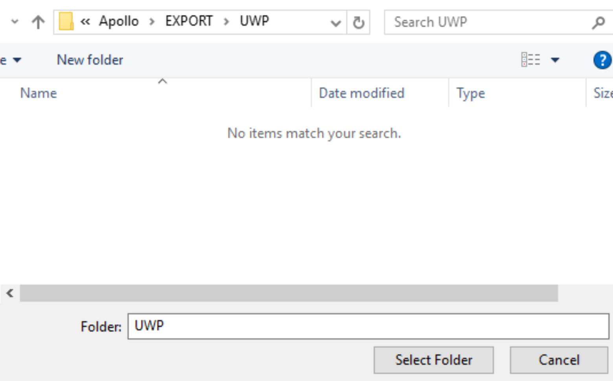

**Step 3: Opening the Visual Studio solution**

Once the export is done, the new folder should automatically open. Open the Apollo.sln.


Once Visual Studio loads the project, change the build configuration to x86, and make sure that it is in Debug. Click the Local Machine button to build, deploy and run the solution and test that it works:


Note: Some build error messages might appear since this is the first time we are building the solution. This is normal as long as the build process is continuing.

The game is a bit slow and laggy. A partial reason is that we are running under the debugger on a Debug build, but let’s see what happens behind the scenes.

Stop the game.

 

**Step 4: Running the Profiler**

Click Debug->Start Diagnostics Tools Without Debugging…
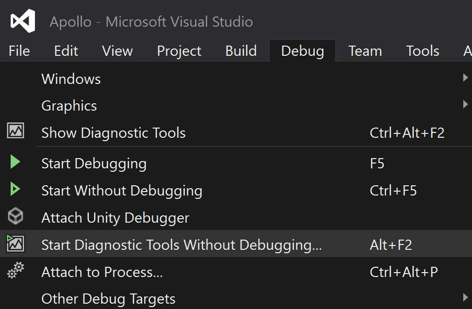

Run the game with only the CPU Usage enabled. If the GPU profiler is enabled, tick that off since we will only be using the CPU Profiler.
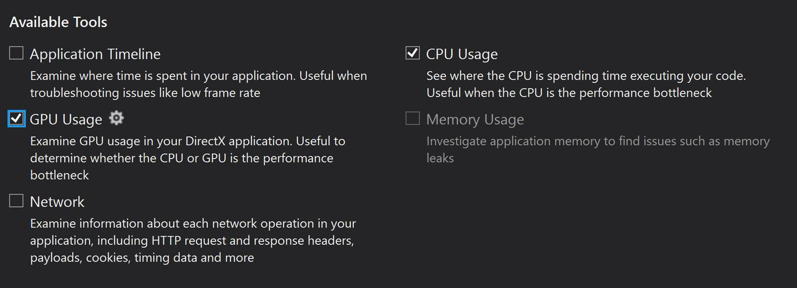

Next, click start to run the game with the profiler:
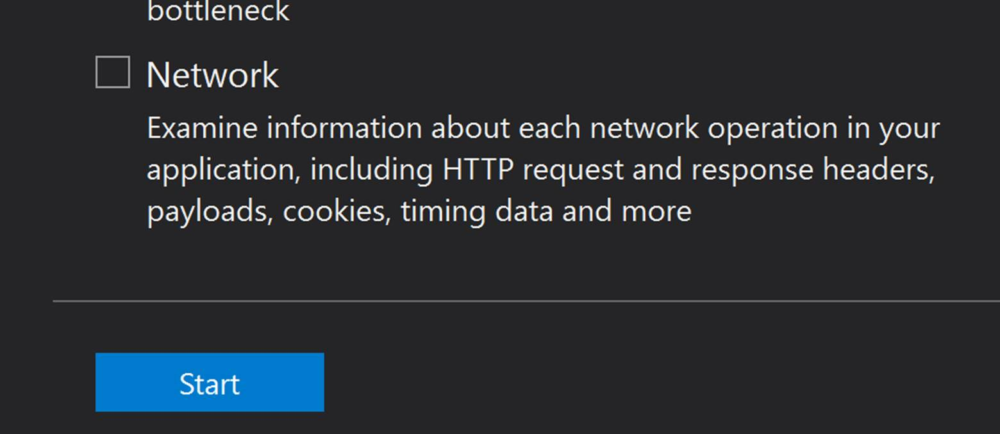

Do a launch and let the game run for a few seconds before clicking the STOP button.
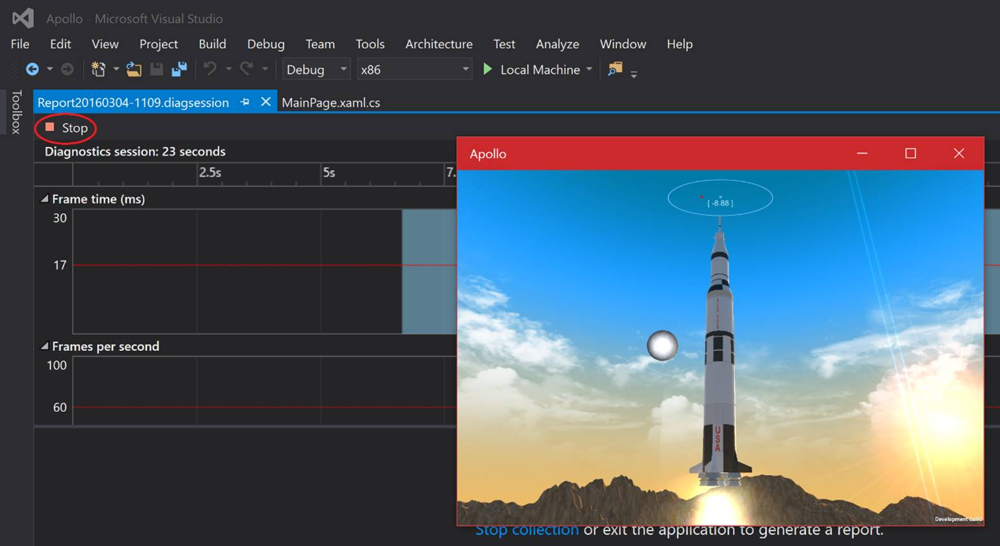

The Graphics Diagnostics tools will gather some information. 

**Step 5: Checking the CPU Profiler**

Go to the CPU Usage tab by clicking the CPU Usage tab below the graphs.

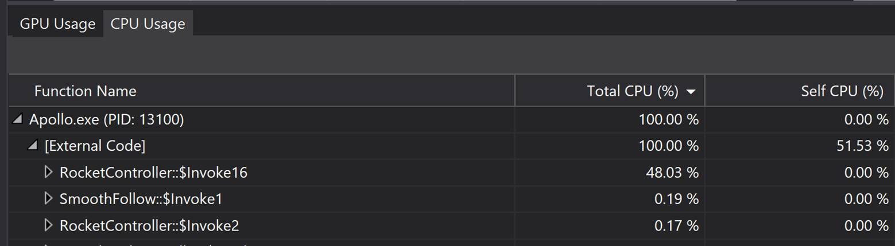

Check the CPU usage and notice that the RocketControllers Update function is using a lot of CPU usage, in my case 48.03%.

Open the RocketController::$Invoke16 tree to dive a bit deeper.

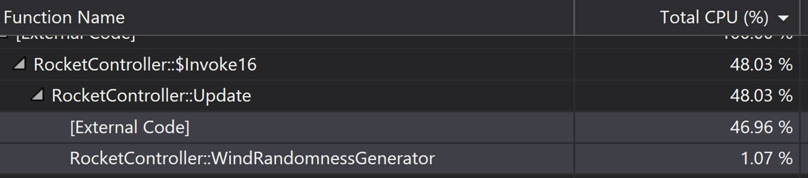

Going into it, we can see that it’s external code that’s spending most of it, and that external code might not have any debugging information. Also, notice the WindRandomnesGenerator function call here. It’s quite low on the CPU Usage, but I know it’s calling external code so this might be the source of error.

Let’s do some more digging by clicking the “Create detailed report…”:

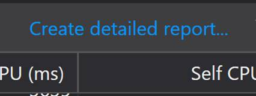

This will give some some more details around what we are doing, and you will see a similar screen to this:

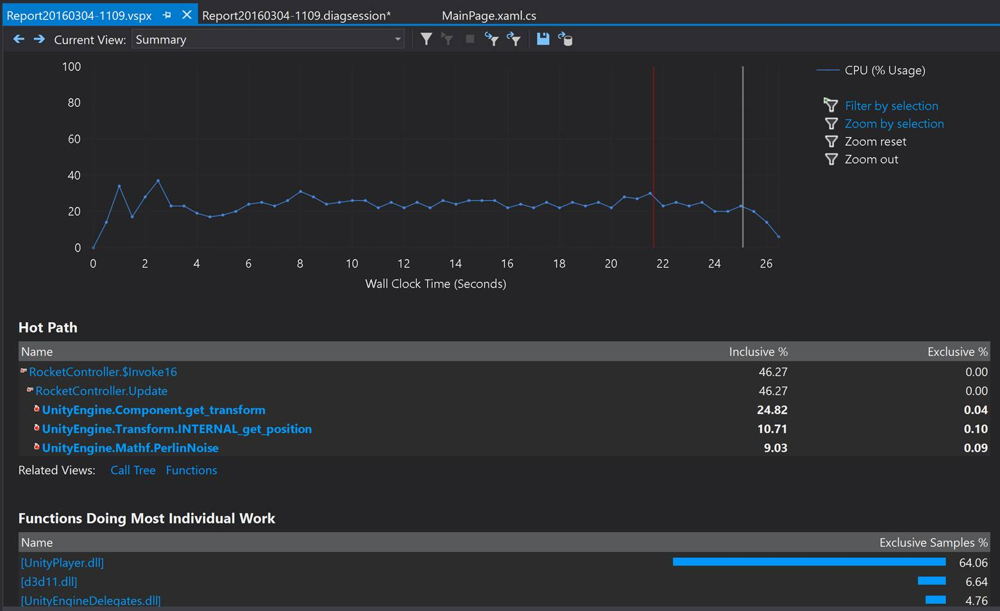

There is a lot of details on this screen, but for now, notice the Hot Path tree, and a call to Mathf.PerlinNoise. In my wind generator, I’m using multiple calls to the PerlinNoise function to generate a pseudo-random wind pattern using various octaves of perlin noise added together.

 

**Step 6: Checking the function**

Going back to Unity, open the script for our RocketController:

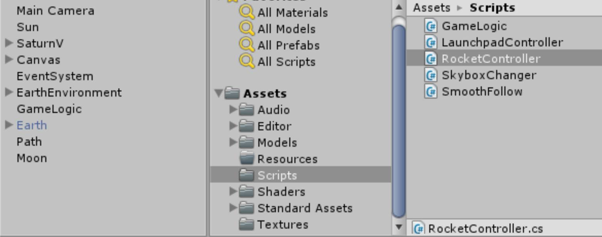

By looking at the various functions in this short scripw, can see that most of the functions in the Update loops are pretty straight forward except for the WindRandomnessGenerator() function we identified above.

To ensure we are looking at the right performance issue, let’s first try to comment out the line of code that is generating the wind. Go to the Update() function in the RocketController script, and comment the first line of code:

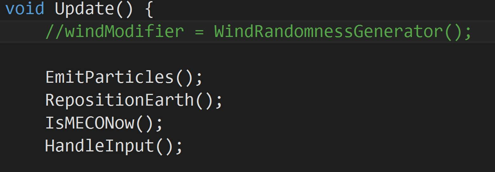

Now, save the change and do the export again from Unity. Once done, do a Rebuild all:

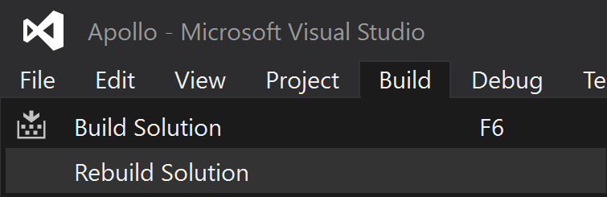

Run the game under CPU profiler like we did earlier:

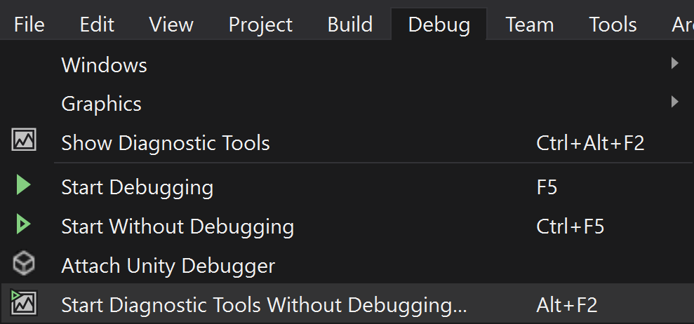

Go the the CPU Usage tab and notice the changed values. The Update function is now at normal levels. 

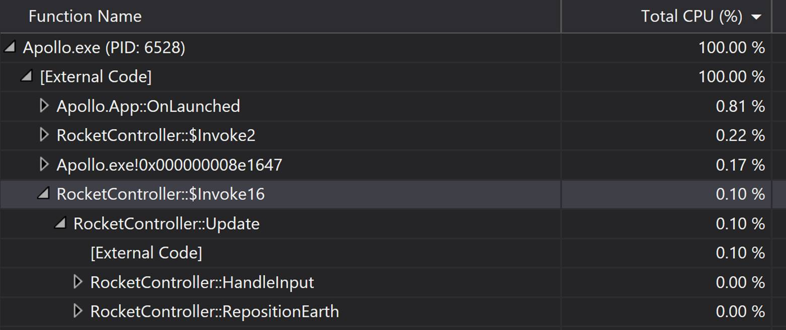

**Step 7: Fixing it**

Uncomment the call to our wind generator:

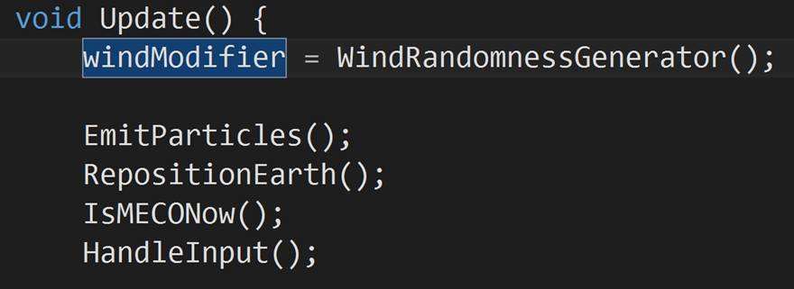

It’s calculating way too many octaves on the Perlin Noise function, one per increase in view while in my intention, I just wanted to have a few octaves with a good range between each octave.

This must be changed. Change the jump in octaves to 20000, significantly reducing the number of calls.

The code should look like this:
```
float WindRandomnessGenerator()
{
    float windRandomness = 0.0f;
    int octaves = 0;
    int lastOctaveDistance = 100000;
    int increaseDistancePerOctave = 20000;

    for (int i = 0; i < lastOctaveDistance; i += increaseDistancePerOctave)
    {
        octaves++;
        windRandomness += Mathf.PerlinNoise(
            transform.position.x / (lastOctaveDistance - i) + 1.0f,
            transform.position.y / (lastOctaveDistance - i) + 1.0f);
    }

    return windRandomness / octaves;
}
```
Export the game again, and run it under the CPU profile like in Step 6.

The issue is now fixed, and we now got a better framerate!

However, we have more graphics issues to fix so let’s move on to the next challenge!

 

#Challenge 2: Shader and Graphic debugging#

 

**Step 1: Identify issue**

Open the Start Project in Unity and play another round of the game. Focus on the moon, and notice that it looks a bit weird.

The VS Graphics Diagnostics tools comes with a set of tools that enables you to see all the drawcalls as well as the history of selected pixels, as well as shader debugging and shader editing.

 

**Step 2: Export as a UWP**

Let’s go ahead and build the solution.
In Unity, click File->Build Settings


Ensure that Windows Store, and from the dropdown, Universal 10 is selected


Also, make sure the Unity C# Projects and the Development Build checkboxes is checked.


Click Build and navigate into EXPORT\UWP and click Select Folder to start the export.


**Step 3: Opening the Visual Studio solution**

Once the export is done, the new folder should automatically open. Open the Apollo.sln.


Once Visual Studio loads the project, change the build configuration to x86, and make sure that it is in Debug. Click the Local Machine button to build, deploy and run the solution and test that it works:


Note: Some build error messages might appear since this is the first time we are building the solution. This is normal as long as the build process is continuing.

Feel free to try the game and ensure that the moon is looking strange.

Stop the game.

 

**Step 4: Run in Graphics Debug mode**

Let’s run this with the Graphics Diagnostics by clicking Debug->Graphics->Start Diagnostics
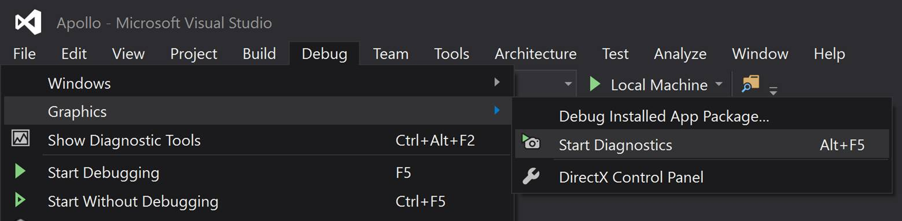

When running the game now, you are presented with performance graphs, as well as a Capture Frame button:
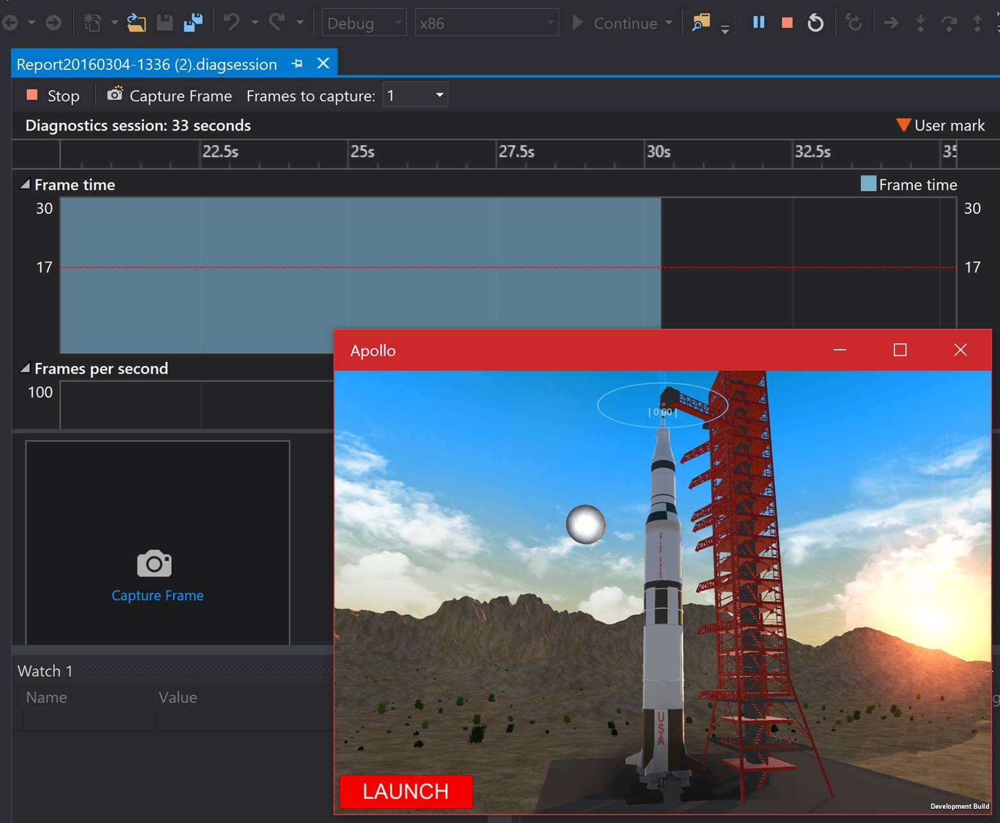

To capture a frame, you can click the Capture Frame button, or press Print screen on the keyboard when having the app in focus.

We are interested in finding out what’s happening with the moon. When the game starts, it’s stationary on the Launchpad, and the broken white moon is visible in the background.

When the moon is visible, capture a frame by clicking the button or using Print screen.

Then, when the frame is captured, you can see it visible where the capture frame button was.

Stop the session by clicking the Stop button:
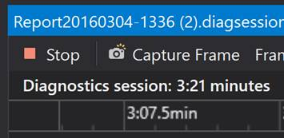

Once the app stops, you can click the captured frame by clicking on the frame header:
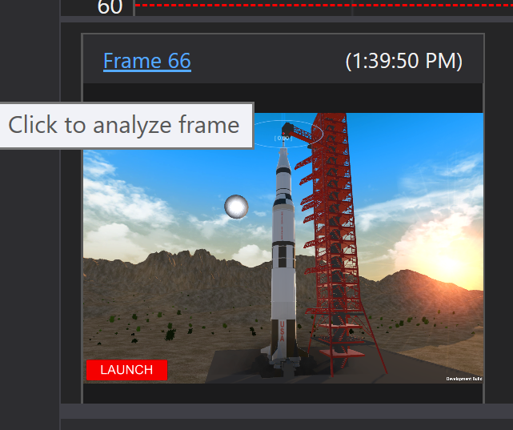

A new tab will open in visual studio, containing a snapshot of the system, processes, state of the app at that time the frame was captured.
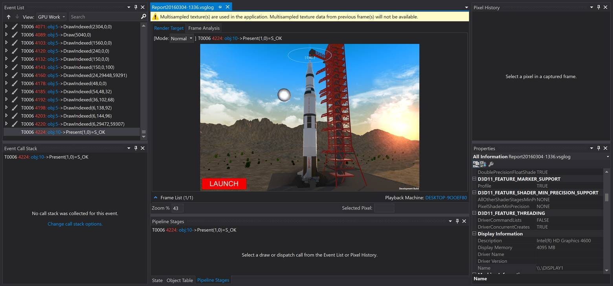

**Step5 – Navigating around in the captured frame**

On the left side, there is a long list of events like draw calls, and in the center we are having a picture that shows the state of the frame at a selected event.

 

**Step 6: Finding the moon**

We are interested in finding the draw call that draws our moon. Click the last event before the Present event to be sure that we are having a preview that has the moon visible. 
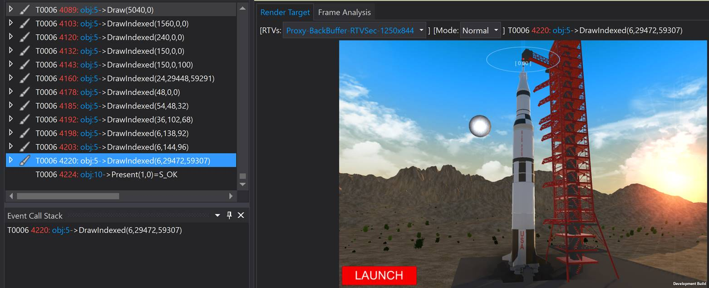

Now, on the frame view, click a pixel inside of the moon. A red marker will show what pixel you have selected:
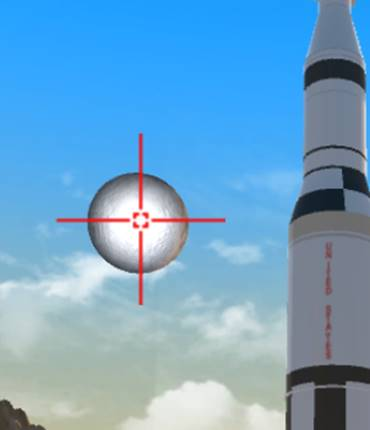

One the right side of this, in the properties view, you can see all the events that are related to this pixel:
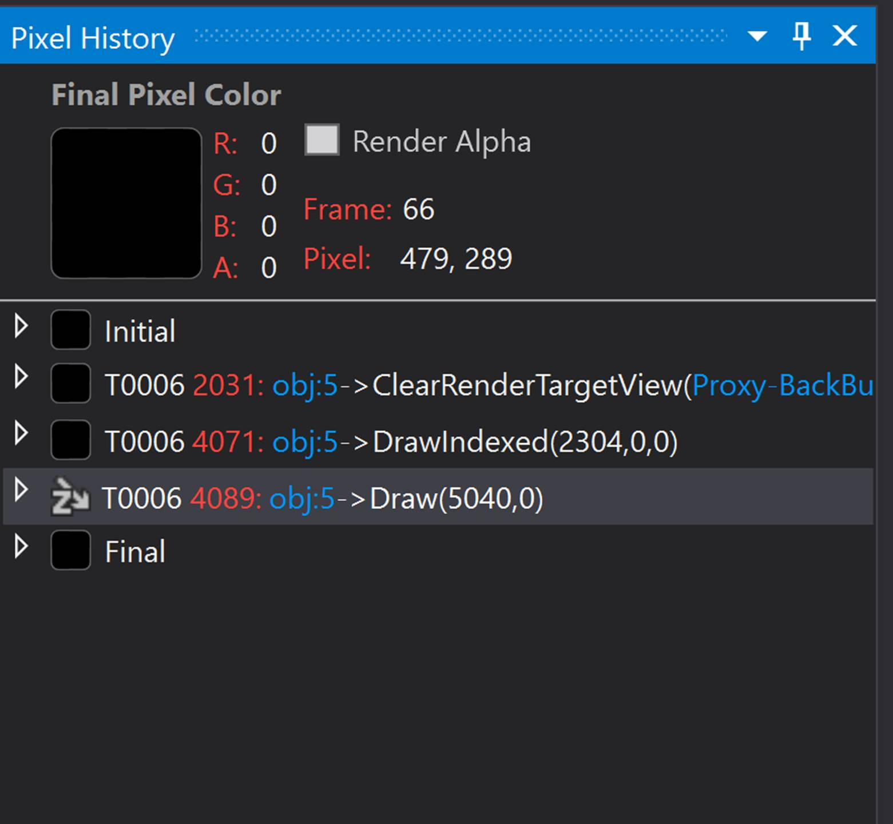

The first one is the one that clears the screen to blue, the next draws the moon and the last draws the skybox. You can click each of these to see how it looks in the frame preview.

Open the event by clicking on the arrow of the event in the pixel history, and open the Triangle header. This will display information about how the pixel is affected, what shaders are being used and what color the various stages produce.
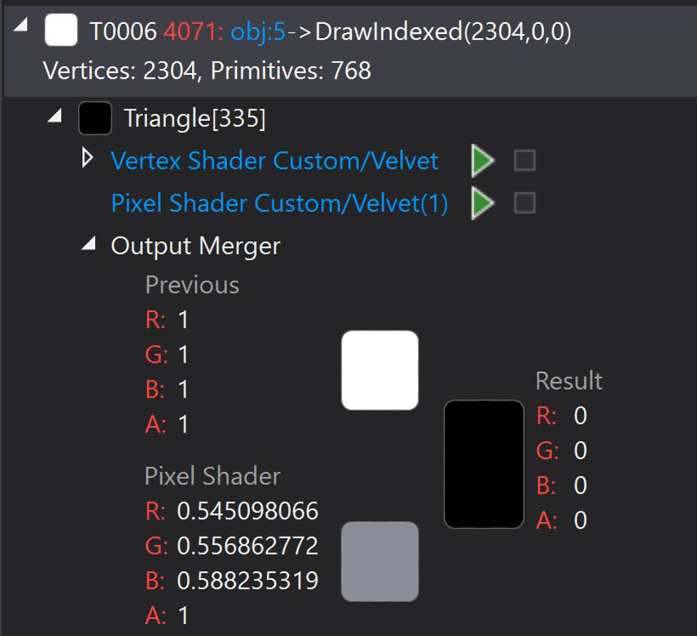

**Step 7: Checking the graphics pipeline**
Below the preview, all the way to the bottom of the screen, there are a few tabs where one is gamed Pipeline Stages. Click this:
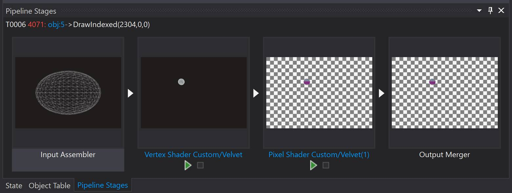

This will show how all the pipeline stages the selected event is having. This one is having one Input stage where all the vertices that are being used is passed into the shader stages. The next is a vertex shader, that is executed once per vertex from the input stage, then there is a pixel shader that gives a color to every pixel, and then finally an output merger that marks the end of the graphics pipeline.

If you click on one of the stages, like the Input Assembler, you can see how the model currently in process looks like in the built in Visual Studio Model Viewer. You can see that this is a sphere, from what the moon is built up from.
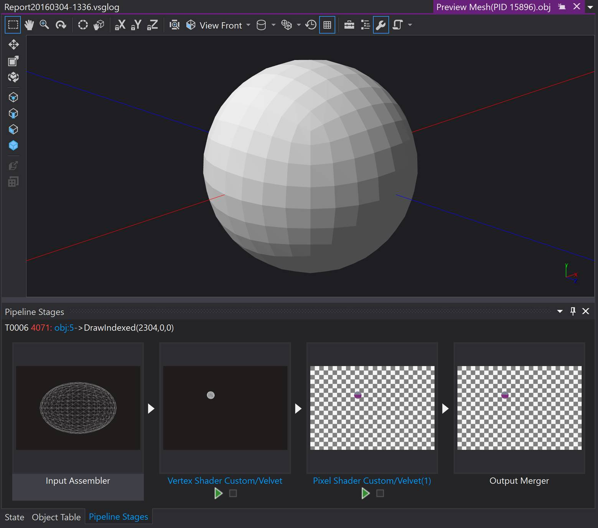

By the looks of it, the sphere looks right so the issue will probably be in the Pixel Shader where we give it color.

 

**Step 8: Debug shader**

Now, below each of the stages in the Pipline Stage view, or in the Pixel History, you can see what shader is being used, as well as a green play button. By clicking on the shader name, you can see the code of the shader. This shader will create a rim around the moon, but by the looks of it, the rim color seems to be in the center, inverse.

We are interested in debugging it, so click the green play button next to the Pixel Shader (the one underlined below):
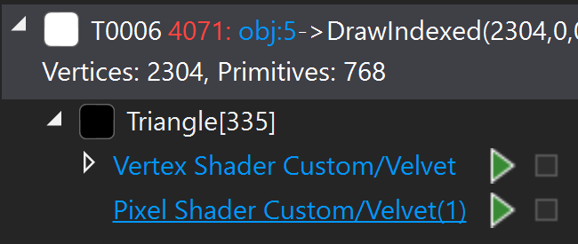

The shader code will become visible, with the possibility to step through the shader:
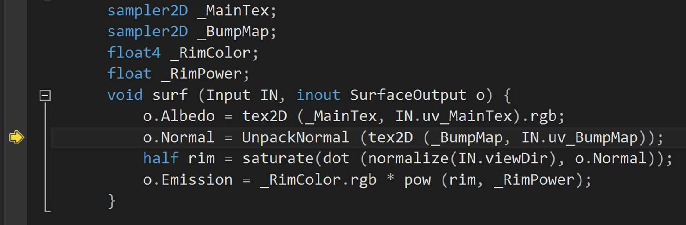

Set a breakpoint at the last line in the shader and step through until you reach this line. Look at the content of the variable named rim.
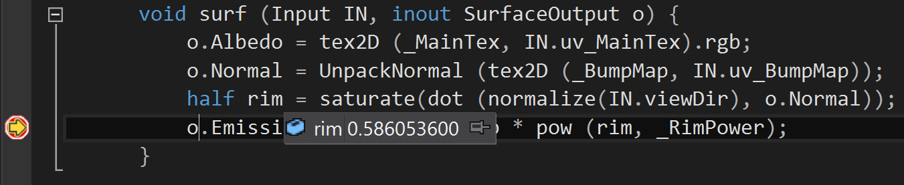

You can use the tools above the tab to step through the shader:
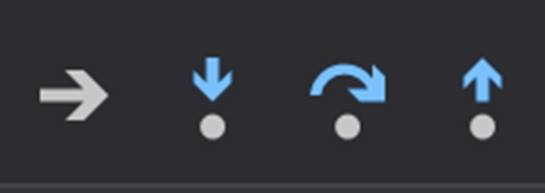

Looking at the calculations of the rim value, we have forgotten to invert it by subtracting it from one. Lets try this, so go ahead and stop the debugger and open the shader for editing.

 

**Step 9: Edit the shader**

Click on the shader tab and edit the code so it looks like this:
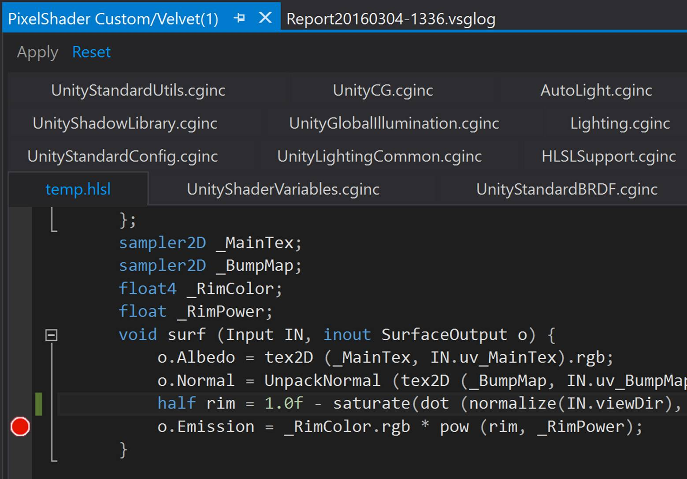

The only change is to write “1.0f – “ in front of saturate at the line that calculates the rim effect.

Save it, and the Frame Capture will update itself to using this shader. Click the frame preview tab, and notice that the moon is now fixed!
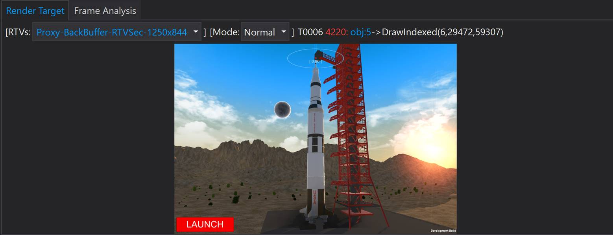

**Step 10: Fix issue in Unity and re-export**

Close the debugging session and go back to Unity, and find the Velvet shader we are using by navingating to the Shaders/Velvet folder:
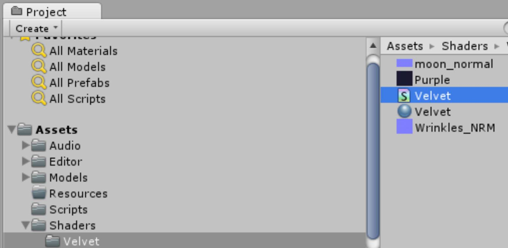

Open this in Visual Studio and make the same change to it, add **1.0f –** in front of saturate.

```
void surf (Input IN, inout SurfaceOutput o) {

    o.Albedo = tex2D (_MainTex, IN.uv_MainTex).rgb;

    o.Normal = UnpackNormal (tex2D (_BumpMap, IN.uv_BumpMap));

    half rim = 1.0f - saturate(dot (normalize(IN.viewDir), o.Normal));

    o.Emission = _RimColor.rgb * pow (rim, _RimPower);

}
```

Save the change.


**Step 11: Test**

Play the game from the Unity Editor, and see that it now works well, and the moon is fixed!

 

 

#Challenge 3: Events and Pipeline Stages#

**Step 1: Export the UWP**

By this stage, we are already familiar with how the game works and how to export the game from Unity and attach the Graphics Diagnostic Tools. The aim here is to learn how the Event List works, and how you can use it.

Export the game from Unity

In Unity, click File->Build Settings


Ensure that Windows Store, and from the dropdown, Universal 10 is selected


Also, make sure the Unity C# Projects and the Development Build checkboxes is checked.


Click Build and navigate into EXPORT\UWP and click Select Folder to start the export.
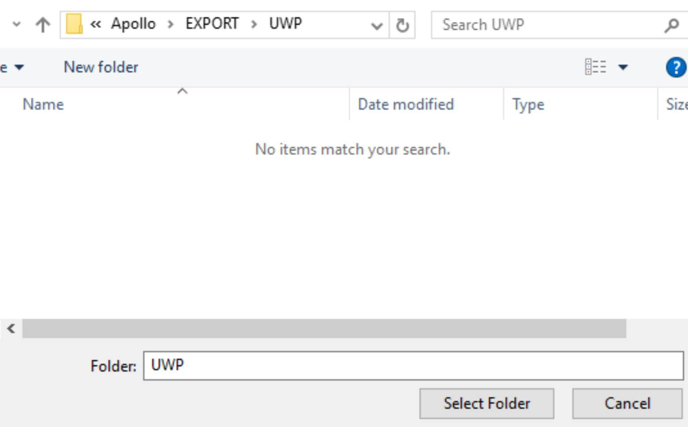

**Step 2: Opening the Visual Studio solution**

Once the export is done, the new folder should automatically open. Open the Apollo.sln.
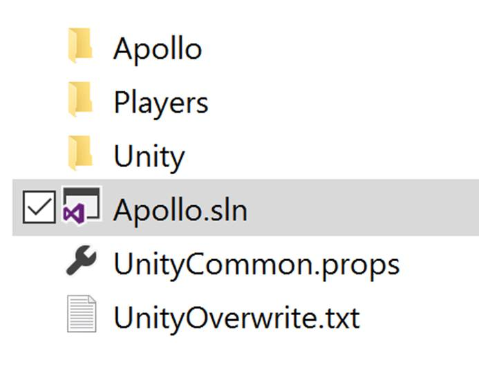

Once Visual Studio loads the project, change the build configuration to x86, and make sure that it is in Debug. Click the Local Machine button to build, deploy and run the solution and test that it works:


Note: Some build error messages might appear since this is the first time we are building the solution. This is normal as long as the build process is continuing.

 

**Step 3: Run in Graphics Debug mode**

Let’s run this with the Graphics Diagnostics by clicking Debug->Graphics->Start Diagnostics


When running the game now, you are presented with performance graphs, as well as a Capture Frame button:


To capture a frame, you can click the Capture Frame button, or press Print screen on the keyboard when having the app in focus.

We are interested in finding out what’s happening with the moon. When the game starts, it’s stationary on the Launchpad, and the broken white moon is visible in the background.

When the moon is visible, capture a frame by clicking the button or using Print screen.

Then, when the frame is captured, you can see it visible where the capture frame button was.

Stop the session by clicking the Stop button:
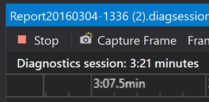


Once the app stops, you can click the captured frame by clicking on the frame header:


A new screen will open in visual studio, containing a snapshot of the system, processes, state of the app at that time the frame was captured.


On the left side, you can see a long list of events. You can click these events to see how the frame looks at that event. 

 

**Step 4: Finding the right clear event**

Let’s try this. Scroll up to a bit over the middle of the list view, and you will see an event that clears the screen to a given color:


Clicking this will show how the frame looks to the right of the list (in the preview):
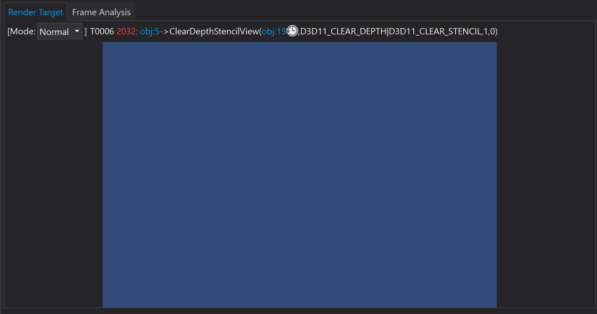

If you follow the events down, clicking the one by one, you will see that events draw what part of the frame like the terrain, the launchpad, the rocket, the particles, the UI and so on.

If you do this one by one (don’t do this), you can see the frame being built up slowly, piece by piece.

 

**Step 5: Finding the draw calls that belong to our tower**

By clicking through the event view, you will first see that a lot of them belong to the terraing, and then another bunch that belong to the tower.

Another way of finding where about the tower draw events are, is by using the pixel history (as we used in Challenge 2)

In the frame view, click on a pixel on the Launchpad tower to view the pixel history:
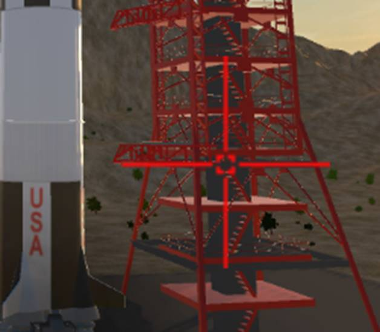

You can see that there are many events that are affecting the pixel:
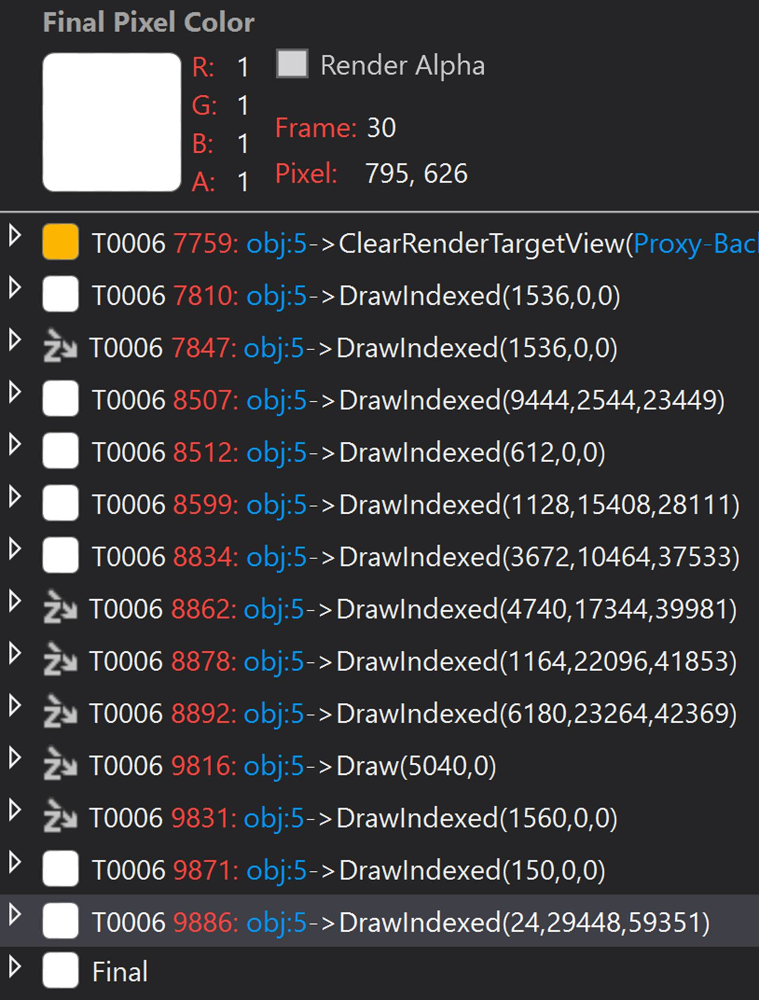

Select one by one, starting from the top to find one that belongs to the tower:
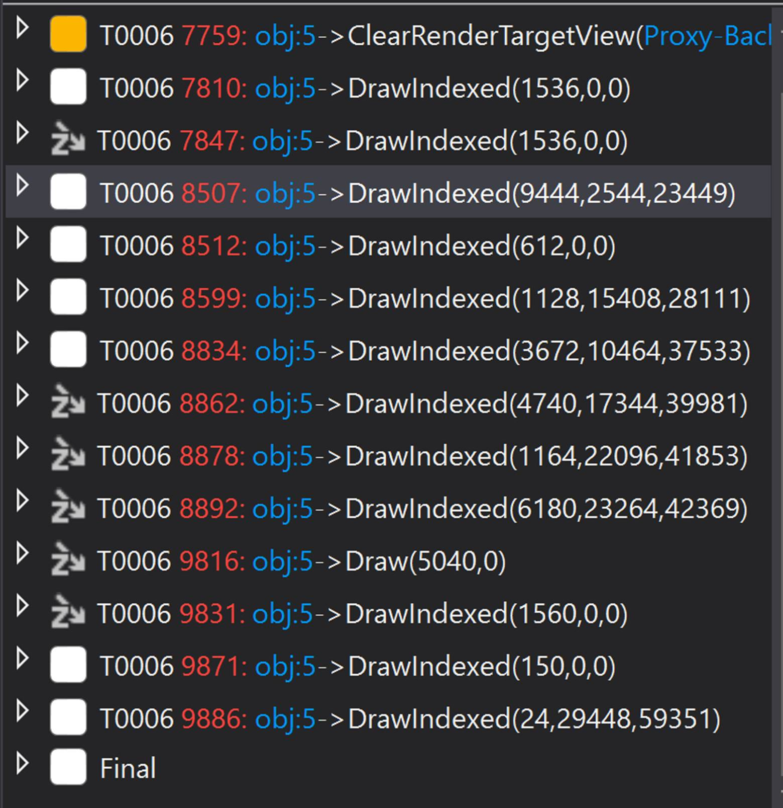

In my case, there are many that belong to the tower. You can identify this by seeing that a part of the tower has been drawn on the frame view, and if you select the Pipeline Stage tab, you can see the part that is currently being drawn:
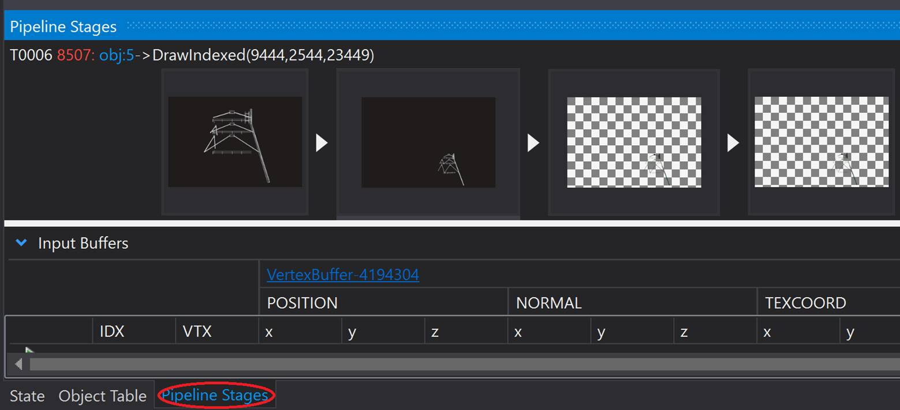

**Step 6: Finding all the draw calls for our tower**

Once you have found one part that belongs to the tower, move upwards to you find the first drawcall for the tower, and move down until the tower has been completely drawn.
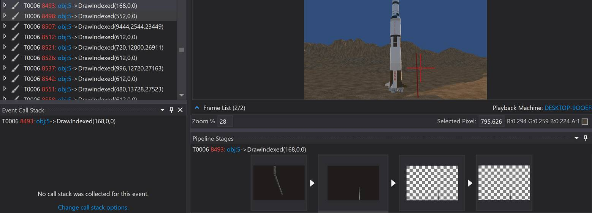

The last part is found here:
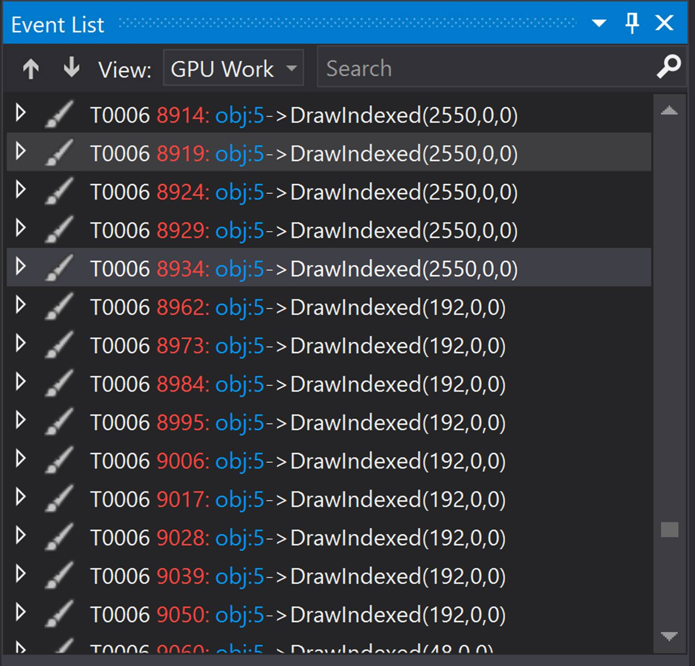
As you can see, there is a lot of draw calls for making the tower. Sometimes this is ok and necessary, but in this case, we are drawing parts of the model multiple times, with the same shader and graphics pipeline stage.

**Step 7: Reducing the draw calls of our tower**

The designer of the launchtower model created another version that got the tower parts combined into one mesh. This will reduce the drawcall we had for each floor of the tower and so on.

In the EndProject folder, the new model has replaced the existing one.

**Step 8: Test**

You can directly open the exported UWP of the EndProject, run it and capture a frame.
You can now see that the most of the tower is rendered in only a couple of drawcalls. 

**The End**

Thank you for going through this lab. We hope that by going through these steps, you have learned how you can use the Diagnostics Tools in your own graphical projects. There are many other problems in this solution, so you you want to go even further, feel free to spend some more time with it.

Thank you!
